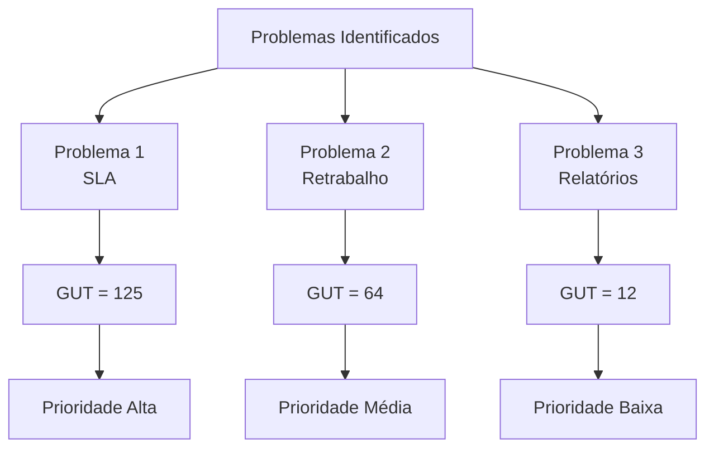

# Capítulo 10 - Matriz GUT

## Objetivo

Compreender como utilizar a Matriz GUT para priorizar problemas de forma estruturada, apoiando a tomada de decisão em projetos de Business Process Management (BPM).

---

# O que é a Matriz GUT?

A Matriz GUT é uma ferramenta de priorização utilizada para classificar problemas considerando três critérios:

- Gravidade (G)
- Urgência (U)
- Tendência (T)

Ela auxilia gestores e consultores a decidir quais problemas devem ser tratados primeiro, direcionando esforços para as situações de maior impacto.

---

# O que significa GUT?

## Gravidade (G)

Avalia o impacto que o problema causa para a organização.

Perguntas que ajudam na análise:

- O problema afeta o cliente?
- Existe impacto financeiro?
- O SLA está sendo comprometido?
- Existe risco para a operação?

---

## Urgência (U)

Avalia quanto tempo a empresa possui para agir.

Perguntas:

- O problema precisa ser resolvido imediatamente?
- Pode esperar alguns dias?
- Existe risco de paralisação?

---

## Tendência (T)

Avalia o comportamento do problema caso nenhuma ação seja tomada.

Perguntas:

- O problema permanecerá igual?
- Vai piorar?
- Pode gerar novos problemas?

---

# Escala de avaliação

| Nota | Significado |
|------:|-------------|
| 1 | Muito Baixo |
| 2 | Baixo |
| 3 | Médio |
| 4 | Alto |
| 5 | Muito Alto |

---

# Como calcular?

O resultado é obtido pela multiplicação:

**G × U × T**

Quanto maior o resultado, maior deve ser a prioridade de tratamento.

---

# Exemplo prático

Imagine os seguintes problemas encontrados durante um diagnóstico.

| Problema | G | U | T | Resultado |
|-----------|:-:|:-:|:-:|----------:|
| Descumprimento de SLA | 5 | 5 | 5 | 125 |
| Retrabalho no cadastro | 4 | 4 | 4 | 64 |
| Relatório manual | 2 | 2 | 3 | 12 |

Neste exemplo, o primeiro problema deve ser tratado antes dos demais.

---

# Exemplo baseado na minha experiência

Durante minha atuação na Torre de Business Process Management (BPM) da TIVIT, indicadores operacionais e SLAs eram acompanhados continuamente.

Quando um indicador apresentava desempenho abaixo do esperado, era necessário avaliar o impacto para a operação, a urgência da intervenção e os riscos de agravamento caso nenhuma ação fosse tomada.

Embora a priorização nem sempre fosse realizada formalmente por meio da Matriz GUT, os conceitos de impacto, urgência e evolução do problema faziam parte da análise para definição dos planos de ação e acompanhamento das melhorias.

---

# Benefícios

A Matriz GUT permite:

- Priorizar problemas de forma objetiva;
- Apoiar decisões baseadas em critérios;
- Direcionar recursos para situações mais críticas;
- Melhorar o planejamento das ações;
- Reduzir riscos operacionais.

---

# Boas práticas

- Definir critérios claros para atribuição das notas.
- Avaliar os problemas em conjunto com as áreas envolvidas.
- Utilizar dados e indicadores para apoiar a análise.
- Revisar a matriz sempre que houver mudanças significativas.

---

# Exemplo Visual

---

# Resumo

| Critério | Objetivo |
|-----------|----------|
| Gravidade | Avaliar o impacto do problema |
| Urgência | Avaliar o tempo disponível para agir |
| Tendência | Avaliar a evolução do problema |

---

## Como calcular a Matriz GUT?

Multiplicando os valores atribuídos para Gravidade, Urgência e Tendência.

**G × U × T**

---

## Quando utilizar?

Sempre que houver diversos problemas identificados e for necessário definir quais devem ser tratados primeiro.

---

# Referências

- Falconi, Vicente. *Gerenciamento da Rotina do Trabalho do Dia a Dia.*
- ABPMP International. *BPM CBOK® – Guide to the Business Process Management Common Body of Knowledge.*
- Campos, Vicente Falconi. *TQC – Controle da Qualidade Total.*

