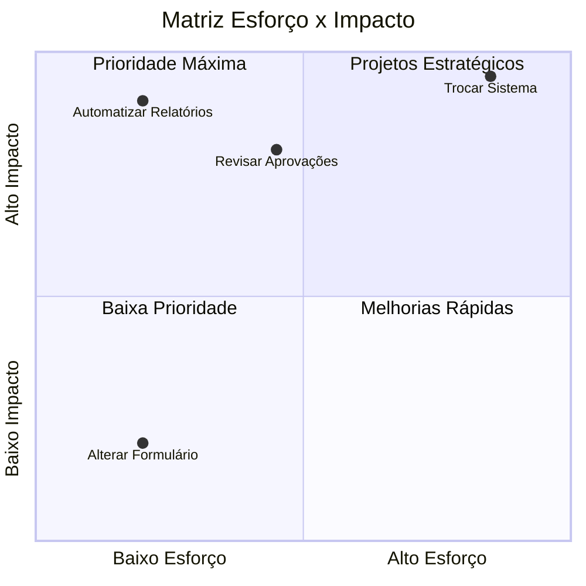

# Capítulo 11 - Matriz Esforço x Impacto

## Objetivo

Aprender a utilizar a Matriz Esforço x Impacto para selecionar e priorizar iniciativas de melhoria em um projeto de Business Process Management (BPM).

---

# O que é a Matriz Esforço x Impacto?

A Matriz Esforço x Impacto é uma ferramenta utilizada para avaliar as melhorias identificadas durante o diagnóstico, considerando dois fatores:

- Esforço necessário para implementar a melhoria;
- Impacto esperado para o negócio.

Seu objetivo é ajudar na tomada de decisão, permitindo que a empresa implemente primeiro as ações que geram maior benefício com menor esforço.

---

# Os dois critérios da matriz

## Esforço

Representa os recursos necessários para implementar a melhoria.

Exemplos:

- Tempo;
- Pessoas;
- Investimento;
- Tecnologia;
- Complexidade.

Quanto maior o esforço, mais difícil será executar a ação.

---

## Impacto

Representa o benefício esperado após a implementação.

Pode estar relacionado a:

- Redução de custos;
- Melhoria do SLA;
- Aumento da produtividade;
- Redução de retrabalho;
- Satisfação do cliente;
- Melhoria da qualidade.

Quanto maior o impacto, maior o valor da melhoria.

---

# Os quatro quadrantes

## Alto Impacto / Baixo Esforço

São as melhorias prioritárias.

Devem ser implementadas primeiro, pois entregam resultados rápidos.

---

## Alto Impacto / Alto Esforço

Projetos estratégicos.

Exigem planejamento, orçamento e acompanhamento.

---

## Baixo Impacto / Baixo Esforço

Melhorias simples.

Podem ser executadas quando houver disponibilidade.

---

## Baixo Impacto / Alto Esforço

Normalmente possuem baixa prioridade.

Devem ser reavaliadas antes da execução.

---

# Exemplo prático

Durante o diagnóstico foram identificadas quatro oportunidades:

| Melhoria | Esforço | Impacto | Prioridade |
|-----------|----------|----------|------------|
| Automatizar relatório | Baixo | Alto | Alta |
| Revisar processo de aprovação | Médio | Alto | Alta |
| Trocar sistema | Alto | Alto | Média |
| Alterar layout de formulário | Baixo | Baixo | Baixa |

---

# Aplicação na minha experiência

Na TIVIT, diversas melhorias eram discutidas durante reuniões de acompanhamento dos indicadores.

Nem todas podiam ser executadas imediatamente.

Era necessário avaliar o benefício esperado, os recursos disponíveis e o impacto para a operação antes da definição dos planos de ação.

Na área de QA, esse raciocínio também era aplicado durante a priorização de correções e melhorias, considerando o impacto para os usuários e o esforço de desenvolvimento.

---

# Benefícios

A Matriz Esforço x Impacto permite:

- Priorizar iniciativas;
- Utilizar melhor os recursos;
- Entregar resultados rápidos;
- Apoiar decisões estratégicas;
- Melhorar o planejamento dos projetos.

---

# Exemplo Visual

---

# Resumo

| Critério | Objetivo |
|-----------|----------|
| Esforço | Avaliar recursos necessários |
| Impacto | Avaliar benefícios para o negócio |

A prioridade deve ser dada às melhorias de alto impacto e baixo esforço.

---
## A diferença entre a Matriz GUT e a Matriz Esforço x Impacto?

A Matriz GUT prioriza problemas com base em Gravidade, Urgência e Tendência.

A Matriz Esforço x Impacto prioriza soluções considerando o esforço necessário e o benefício esperado.

---

# Referências

- ABPMP International. BPM CBOK®.
- Falconi, Vicente. Gerenciamento da Rotina do Trabalho do Dia a Dia.
- PMBOK® Guide – Project Management Institute.

---

