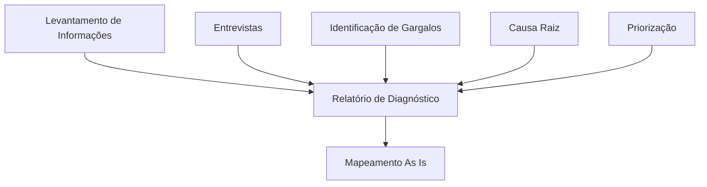

# Capítulo 12 - Relatório de Diagnóstico

## Objetivo

Compreender a estrutura de um Relatório de Diagnóstico em um projeto de Business Process Management (BPM) e sua importância como base para a definição das melhorias e do redesenho dos processos.

---

# O que é um Relatório de Diagnóstico?

O Relatório de Diagnóstico é o documento que consolida todas as informações levantadas durante a fase de diagnóstico.

Seu objetivo é apresentar uma visão clara da situação atual da organização, evidenciando problemas, oportunidades de melhoria, riscos e recomendações.

Esse documento serve como base para a próxima etapa do projeto: o mapeamento do processo atual (As Is) e o desenho do processo futuro (To Be).

---

# Objetivos do Relatório

O relatório deve permitir que gestores e patrocinadores do projeto compreendam:

- Como o processo funciona atualmente;
- Quais problemas foram identificados;
- Quais são as causas desses problemas;
- Quais riscos existem para a operação;
- Quais oportunidades de melhoria foram encontradas;
- Quais ações devem ser priorizadas.

---

# Estrutura recomendada

Um Relatório de Diagnóstico normalmente contém:

## 1. Contexto

Descrição do processo analisado, escopo do projeto e objetivos.

---

## 2. Metodologia

Descrever como o diagnóstico foi realizado.

Exemplo:

- Entrevistas;
- Observação das atividades;
- Análise documental;
- Avaliação de indicadores;
- Reuniões com as áreas envolvidas.

---

## 3. Situação Atual

Apresentação do funcionamento atual do processo.

Nesta etapa podem ser incluídos:

- Fluxos;
- Indicadores;
- Tempos de execução;
- Volume de atividades;
- Sistemas utilizados.

---

## 4. Problemas Identificados

Relacionar os principais problemas encontrados.

Exemplo:

| Problema | Impacto |
|-----------|----------|
| Retrabalho | Aumento do tempo de atendimento |
| Descumprimento de SLA | Insatisfação do cliente |
| Atividades manuais | Baixa produtividade |

---

## 5. Causas Identificadas

Apresentar os resultados da análise de causa raiz.

Ferramentas utilizadas:

- 5 Porquês;
- Diagrama de Ishikawa;
- Entrevistas;
- Indicadores.

---

## 6. Priorização

Demonstrar como os problemas foram priorizados.

Ferramentas:

- Matriz GUT;
- Matriz Esforço x Impacto.

---

## 7. Recomendações

Apresentar sugestões de melhoria.

Exemplos:

- Automatizar atividades repetitivas;
- Padronizar procedimentos;
- Revisar aprovações;
- Capacitar equipes;
- Revisar indicadores.

---

## 8. Próximos Passos

Encaminhamento para as próximas fases do projeto.

Exemplo:

- Mapeamento As Is;
- Desenho To Be;
- Plano de implementação;
- Definição de KPIs.

---

# Aplicação na minha experiência profissional

Durante minha atuação na Torre de Business Process Management (BPM) da TIVIT, os indicadores operacionais, auditorias e reuniões de acompanhamento forneciam informações essenciais para compreender a situação dos processos.

Essas análises permitiam identificar desvios, avaliar impactos e definir planos de ação voltados para a melhoria contínua.

Na área de Qualidade de Software (QA), a elaboração de evidências de testes, relatórios de defeitos e indicadores de qualidade também exigia organização das informações para apoiar a tomada de decisão das equipes de desenvolvimento e gestão.

---

# Benefícios

Um bom Relatório de Diagnóstico:

- Consolida todas as informações do projeto;
- Facilita a comunicação com gestores;
- Apoia decisões estratégicas;
- Direciona a fase de melhoria dos processos;
- Garante rastreabilidade das análises realizadas.

---

# Exemplo Visual

---

# Modelo Simplificado

| Seção | Conteúdo |
|--------|----------|
| Contexto | Escopo e objetivos |
| Metodologia | Como o diagnóstico foi realizado |
| Situação Atual | Funcionamento do processo |
| Problemas | Principais dificuldades encontradas |
| Causas | Resultados da análise |
| Priorização | GUT e Esforço x Impacto |
| Recomendações | Melhorias sugeridas |
| Próximos Passos | Continuação do projeto |

---

# Boas práticas

- Utilizar linguagem objetiva e clara.
- Basear as conclusões em evidências.
- Apresentar indicadores sempre que possível.
- Registrar as recomendações de forma prática.
- Validar o relatório com as áreas envolvidas antes da apresentação final.

---

## Quem utiliza esse documento?

Gestores, patrocinadores do projeto, consultores, analistas de processos e demais partes interessadas na melhoria do processo.

---

# Referências

- ABPMP International. *BPM CBOK® – Guide to the Business Process Management Common Body of Knowledge.*
- Hammer, Michael; Champy, James. *Reengineering the Corporation.*
- Falconi, Vicente. *Gerenciamento da Rotina do Trabalho do Dia a Dia.*

---

